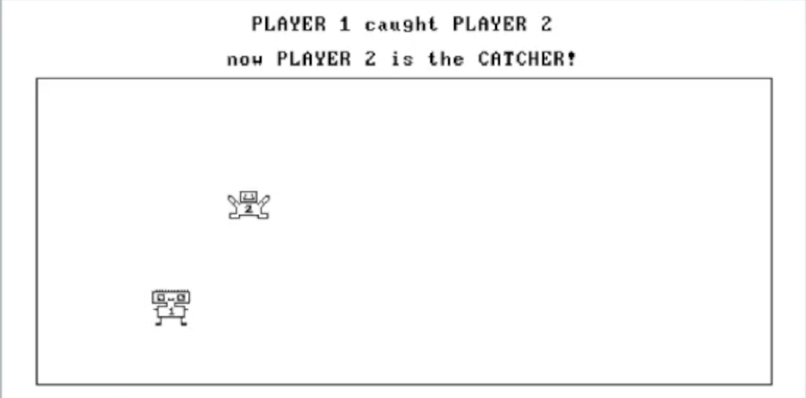

# TOFESET – Final Project for Nand2Tetris

Two-player tag game developed as the final project for the Nand2Tetris course.
---

Developed by **Romi Golan** and **Ruth Steinberg**.

## 🎮 Game Overview

**Tofeset** (Hebrew for "Tag") is a nostalgic reinterpretation of the classic childhood game — but in digital form. Two players take turns chasing each other, and when a player is caught, a riddle must be solved together in order to proceed.

---

## Files

- `Main.jack` – Initializes the game and controls the main loop.
- `GameOn.jack` – Handles gameplay: movement, collisions, and riddle logic.
- `Player1.jack` – Controls Player 1.
- `Player2.jack` – Controls Player 2.

## Technical Highlights

- Written in Jack language for the Hack platform
- Uses low-level screen and memory manipulation for visuals
- Distinct key controls per player (e.g., `WASD` vs `IJKL`)
- Integrates `Screen`, `Keyboard`, and `Output` OS classes

## How to Run

1. Open the Nand2Tetris [IDE](https://nand2tetris.github.io/web-ide/compiler). 
2. Load all `.jack` files.
3. Compile.
4. Run `Main.jack`.

## Controls

- **Player 1:** `W`, `A`, `S`, `D`
- **Player 2:** `I`, `J`, `K`, `L`

## Demo Video

📹 [Watch here](https://drive.google.com/file/d/1n9Jyqirl0RQD-fPGpO-tmIDeWQqwxiSF/view?usp=sharing)

